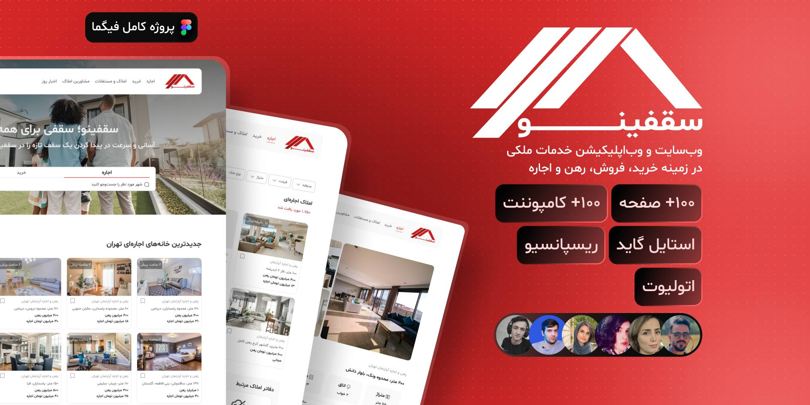

<!-- Title -->
<div align="center">
  <h2>
    سقفینو
  </h2>

  
</div>

<!-- About -->

<div align="center">
  <h2>
    درباره سقفینو
  </h2>
  <p>
   پروژه «سقفینو» پلتفرمی آنلاین برای خرید، فروش و اجاره املاک است.
  </p>
</div>

<!-- Table of Contents -->

<div align="center">
  <h2>
    فهرست مطالب
  </h2>
</div>

[قابلیت های پروژه](#project_Features)|
[تکنولوژی های استفاده شده در فرانت اند](#technologiesـusedـinـfrontend)|
[تکنولوژی های استفاده شده در بک اند](#technologiesـusedـinـbackend)|
[نحوه اجرای پروژه در سمت فرانت اند](#how_to_run_frontend)|
[نحوه اجرای پروژه در سمت بک اند](#how_to_run_backend)|
[توسعه دهندگان](#developers)|

<!-- Project Features -->

<div align="center">
  <h2 id="project_Features">
    قابلیت های پروژه
  </h2>
</div>

<div dir="rtl">
  <ul>
    <li>احراض هویت با شماره تلفن</li>
    <li>قابلیت ویرایش اطلاعات کاربر</li>
    <li>اضافه کردن آگهی ها به لیست ‌‌‌ذخیره شده ها و دریافت آن در پروفایل</li>
    <li>قابلیت فیلتر پیشرفته بر روی آگهی ها</li>
    <li>امکان ایجاد آگهی یا حذف آن</li>
    <li>امکان ثبت کامنت، گزارش و امتیاز به مشاور یا املاک</li>
    <li>قابلیت جستجو در لیست مشاورین یا املاک ها</li>
  </ul>
</div>

<!-- Technologies Used In Frontend -->

<div align="center">
  <h2 id="technologiesـusedـinـfrontend">تکنولوژی های استفاده شده در فرانت اند</h2>

 `Ts`
 `NextJs`
 `Tailwind`
 `NextUi`
 `React Query`
 `Axios`
 `Swiper`
 `Zustand`

 `React Hook Form`

</div>

<!-- Technologies Used In Backend -->

<div align="center">
  <h2 id="technologiesـusedـinـbackend">تکنولوژی های استفاده شده در بک اند</h2>

`Python`
`PostgreSQL`  
 `Redis`
`Django`
`AWS S3 storage`
`Django RestFramework`

  <!-- BackEnd -->

</div>

<!-- How to Run FrontEnd -->

<div>
  <h2 align="center" id="how_to_run_frontend">نحوه اجرای پروژه در سمت فرانت اند</h2>

`1`

```bash
git clone git@github.com:Nariman-Fallahi/saghfinoo.git
```

`2`

```bash
cd saghfinoo && cd frontend
```

`3`

```bash
npm i
```

`4`

```bash
npm run dev
```

</div>

<!-- How to Run BackEnd -->

  <h2 align="center" id="how_to_run_backend">نحوه اجرای پروژه در سمت بک اند</h2>

`1`

```bash
git clone git@github.com:yaghoubi-mn/saghfinoo.git
```

`2`

```bash
cd saghfinoo/backend
```

`3`

```bash
pip install -r requirements.txt
```

`4`

```bash
python3 manage.py runserver
```

or

```bash
python manage.py runserver
```

</div>

<!-- Developers -->

<div align="center">
  <h2 id="developers">
    توسعه دهندگان
  </h2>
</div>

<div dir="rtl">
  <h3 style="display: inline;">برنامه نویس فرانت اند : </h3>
   <span>نریمان فلاحی</span>

<h3 style="display: inline;">برنامه نویس بک اند : </h3>
    <span>محمد امین یعقوبی</span>

<h3 style="display: inline;">طراحان رابط کاربری : </h3>
    <span>شقایق پروین </span>، 
    <span>آیدا تقی‌زاده </span>،
    <span>مریم شکاتی </span>،
    <span>امین خسروتاج </span>،
    <span>سردار وظیفه </span>
</div>
